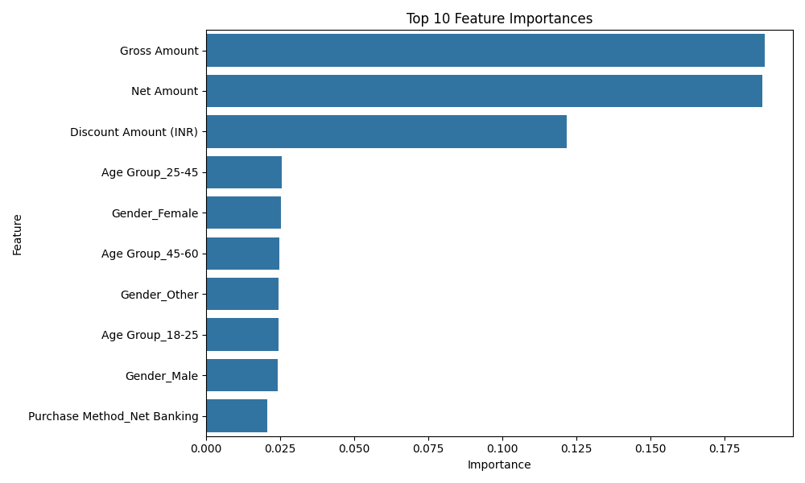

# Predictive-Modelling-with-Random-Forest

# 🔍 Retail Product Category Prediction using Random Forest

This project focuses on building a **machine learning classification model** to predict the **Product Category** of retail transactions using **Random Forest Classifier**. The model is trained on various customer, transaction, and payment features to uncover which ones are most influential in driving product purchases.

---

## 🧾 Dataset

The dataset (`project1_df.csv`) contains anonymized retail transaction data with the following types of features:
- **Transaction Details** (Net Amount, Gross Amount, Discount Amount)
- **Customer Demographics** (Age Group, Gender)
- **Payment Methods**
- **Product Category** *(Target)*

---

## 🧠 Objective

To build a predictive model that accurately classifies retail transactions into **product categories** and to analyze the most important factors influencing the model's decisions.

---

## 🛠️ Technologies Used

- Python
- Pandas & NumPy
- Scikit-learn (Random Forest, Pipelines, GridSearchCV)
- Seaborn & Matplotlib for visualization

---

## 📈 Model Overview

- Preprocessing: Removed irrelevant columns and encoded categorical variables.
- Model: **Random Forest Classifier** within a **Pipeline** (includes `StandardScaler`).
- Tuning: Performed **Grid Search with Cross Validation** to optimize hyperparameters.
- Evaluation: Confusion matrix, classification report, and cross-validation accuracy.

---

## 🌟 Top Features (Feature Importance)

Below is a chart of the top 10 most influential features in predicting the product category:



Key highlights:
- **Gross Amount**, **Net Amount**, and **Discount Amount (INR)** were the most important predictors.
- Customer demographics like **Age Group** and **Gender** also played a role.
- **Purchase Method** features had lower but non-zero impact.

---

## 🧪 How to Run

1. Install the required libraries:
   ```bash
   pip install pandas scikit-learn matplotlib seaborn
2. Place project1_df.csv and predictive model.py in the same directory.

3. Run the model:
python "predictive model.py"

4. The script will:
Train a model with hyperparameter tuning.
Evaluate its performance.
Display a bar chart of top feature importances.

✅ Results Summary
Model Type: Random Forest Classifier

Best Parameters: Tuned using GridSearchCV

Mean CV Accuracy: ~30%

📌 Future Enhancements
Compare performance with other classifiers (e.g., XGBoost, Logistic Regression).
Add SHAP or LIME for explainable AI.
Incorporate additional features like purchase frequency or recency.
Deploy the model using Streamlit for interactive predictions.


📧 Email: hiremathkedar05@gmail.com
🔗 LinkedIn: www.linkedin.com/in/hiremathkedar

